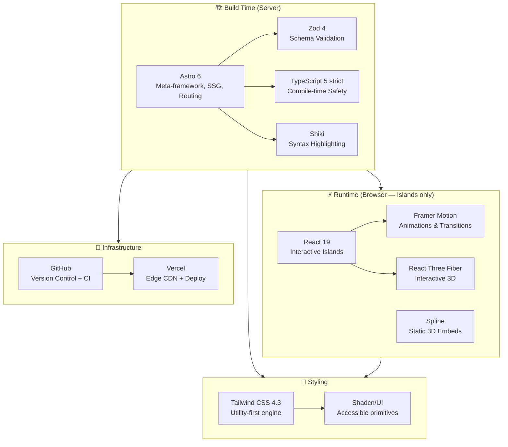
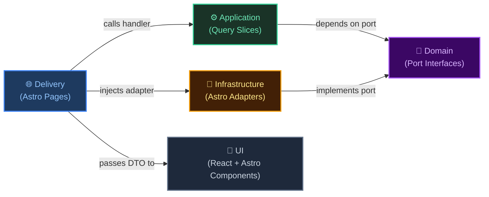
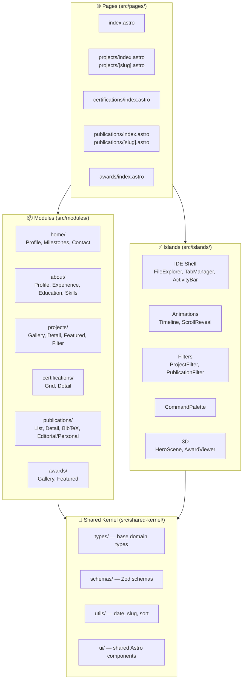
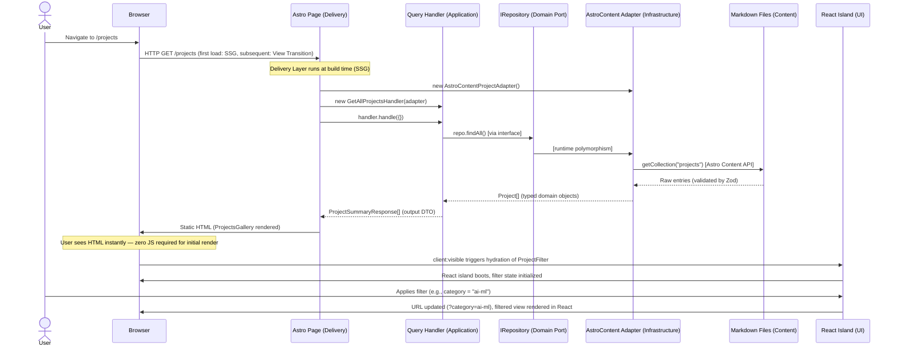
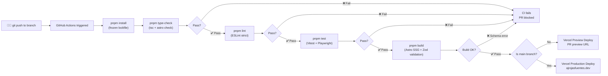

# `ajrojasfuentes.dev` — Professional Portfolio

## Complete Project Specifications

> **Version:** 2.0 — Authoritative Document  
> **Status:** Approved Draft — Living Document  
> **Domain:** `ajrojasfuentes.dev`  
> **Architecture:** MVSD-Lite (Modular · Vertical Slices · Query-CQRS · DDD Contracts)  
> **Stack:** Astro 6 · React 19 · Framer Motion · R3F · Spline · TypeScript 5 · Zod 4 · Tailwind CSS 4.3 · Shadcn/UI  

---

## Table of Contents

1. [Project Identity & Vision](#1-project-identity--vision)
2. [Objectives, Scope & Expectations](#2-objectives-scope--expectations)
3. [Requirements](#3-requirements)
4. [Base Tech Stack](#4-base-tech-stack)
5. [Pillar Principles](#5-pillar-principles)
6. [Architecture — MVSD-Lite](#6-architecture--mvsd-lite)
7. [Visual & UI Design](#7-visual--ui-design)
8. [Directory Structure](#8-directory-structure)
9. [Rules & Restrictions](#9-rules--restrictions)
10. [Recommendations & Summary](#10-recommendations--summary)

---

## 1. Project Identity & Vision

### 1.1 What This Project Is

A high-performance personal portfolio website for a professional whose career sits at the precise intersection of three disciplines:

| Discipline | Domain |
|---|---|
| **Data Automation & AI Engineering** | ML pipelines, intelligent automation, data architecture, LLM systems |
| **Computer Engineering** | Software architecture, backend systems, full-stack development, CS theory |
| **Scientific Research** | Academic publications in CS and Machine Learning, international research (CERN), algorithmic competition (ICPC) |

This is not a résumé on a webpage. It is a **curated technical artifact** — an engineered product that communicates, through its own construction and aesthetics, the same discipline the author applies to every system they build.

### 1.2 The Core Metaphor: The Elevated IDE

The interface is inspired by a **modern IDE** (VS Code visual grammar), elevated and refined into a professional showcase. The paradigm manifests as:

- A left **Activity Bar** with section icons
- A collapsible **File Explorer** sidebar representing portfolio sections as a directory tree
- A **Tab Bar** where content items open as editor files
- A **Breadcrumb** for spatial orientation
- A main **Editor/Content Area** that renders all content — from the hero landing to individual project READMEs
- A **Status Bar** showing context-aware information

This metaphor is not superficial decoration. It sends a precise signal to anyone evaluating this portfolio: the author lives inside development environments and builds this kind of thinking into everything they create.

### 1.3 The Signal

> *"This portfolio was built by someone who thinks architecturally, writes disciplined code, understands data systems at scale, and produces academic-grade reasoning. The portfolio itself is the first proof."*

Every technical decision — from the MVSD-Lite architecture to the Zod-validated content schemas to the zero-JS-by-default delivery strategy — is itself part of the portfolio.

---

## 2. Objectives, Scope & Expectations

### 2.1 Primary Objectives

| ID | Objective | Description | Success Signal |
|---|---|---|---|
| **O1** | Technical Identity | Project a professional, development-native identity through an elevated IDE-inspired UI | Visitor immediately recognizes a software professional, not a template user |
| **O2** | Career Centralization | Showcase all professional milestones: CERN, ICPC, research, projects, certifications, and publications in one structured hub | All professional content accessible within 2 clicks from any section |
| **O3** | Extreme Maintainability | Content updates require zero presentation-layer changes — pure "content as code" via Markdown | Adding a new project = one `.md` file. No component changes. |
| **O4** | Peak Performance | 90+ Lighthouse score across all categories via Islands Architecture and zero-JS-by-default | Measured Lighthouse score ≥ 90 on every route after production deployment |
| **O5** | Compile-time Correctness | All data contracts enforced at build time via Zod 4 schemas — no runtime data errors | Build fails on any schema violation; production never serves malformed data |
| **O6** | Evolution-Ready | Architecture supports adding new sections, content types, and integrations without refactoring | New section = new module. Existing modules untouched. |

### 2.2 Secondary Objectives

- Serve as a live architectural case study — the portfolio demonstrates the same engineering maturity it claims
- Provide stable, shareable deep links to every content item
- Establish a consistent, memorable professional brand
- Be deployment-automated from day one — `git push` → production, no manual steps
- Be structured for the AI Chat assistant and Blog as documented future additions (YAGNI applied)

### 2.3 Scope

#### In-Scope ✅

```
• Static Site Generation (SSG) with Astro 6 as the default deployment mode
• Git-based CI/CD to Vercel, deploying to ajrojasfuentes.dev
• Full IDE-shell navigation: Activity Bar + File Explorer + Tabs + Breadcrumb + Status Bar
• Home/Landing page: Hero, Academic Timeline, Experience Timeline, Milestones, Skills, Contact
• Four dedicated content sections: Projects, Certifications, Publications, Awards
• Markdown/MDX content with Zod 4 schema validation enforced at build time
• React 19 islands for interactive components (timelines, filters, tabs, 3D scenes)
• Framer Motion for layout transitions, micro-interactions, and physics-based animations
• React Three Fiber (R3F) for interactive 3D elements
• Spline for static, non-reactive 3D hero/background elements
• TypeScript 5 strict mode across the entire codebase
• Tailwind CSS 4.3 for styling + Shadcn/UI for accessible component primitives
• Responsive design: desktop-first, fully functional on tablets and mobile
• Dark theme by default, with light theme toggle
• SEO: per-page Open Graph, Twitter Cards, JSON-LD structured data, sitemap.xml
• Deep linking: every content item has a stable, canonical, shareable URL
• WCAG 2.1 AA accessibility compliance
• Contact section with social links and a direct contact form (Astro Server Action)
• Global command palette (Cmd/Ctrl+K) for fast keyboard navigation
```

#### Out of Scope — at launch ❌

```
• Transactional databases (PostgreSQL, MySQL, SQLite, Astro DB)
• User authentication or session management of any kind
• Docker, Kubernetes, or any self-managed infrastructure
• AI Chat assistant (architecture ready; not built at launch — YAGNI)
• Blog/Writing section (architecture ready; not built at launch — YAGNI)
• Comments or social interaction features
• Real-time data feeds (GitHub stats, citation counts updated live)
• Custom analytics dashboard or admin panel
• Server-Side Rendering (SSR) at launch — SSG is sufficient
```

> **On deferred features:** Out-of-scope does not mean forbidden. The MVSD-Lite architecture is specifically designed so that each deferred feature can be added as a new module with zero changes to existing code. YAGNI governs the launch; the architecture governs growth.

### 2.4 Expectations by Stakeholder

| Visitor Type | What They Need | How the Portfolio Delivers |
|---|---|---|
| **Technical Recruiter** | Quick overview of skills, experience, projects | Hero discipline tags, experience timeline, featured projects grid |
| **Hiring Engineer** | Depth: architecture decisions, code quality signals, project complexity | Project detail READMEs, publication links, GitHub links, the architecture of the portfolio itself |
| **Academic Contact** | Publications list, research affiliations, ORCID/Scholar links | Dedicated publications section with DOI, BibTeX export, editorial vs. personal segmentation |
| **Conference / Event Organizer** | Bio, milestones, institutional affiliations | Hero, milestones section, downloadable CV link |
| **General Visitor** | Engaging, fast, navigable | Sub-second load, smooth animations, IDE metaphor as an interesting UX hook |

---

## 3. Requirements

### 3.1 Functional Requirements

#### FR-SHELL — IDE Navigation Shell

| ID | Requirement |
|---|---|
| **FR-SHELL-01** | The application must render a persistent IDE chrome wrapper: Activity Bar (leftmost), File Explorer sidebar, Tab Bar, Breadcrumb, Editor Area, Status Bar |
| **FR-SHELL-02** | The **Activity Bar** must contain icon buttons for: Explorer, Search, About, Projects, Certifications, Publications, Awards. Active section highlighted with accent color |
| **FR-SHELL-03** | The **File Explorer** must render a dynamic tree of all content items, organized by section (folder), with file-type icons per content type |
| **FR-SHELL-04** | Clicking any item in the File Explorer opens it as a new **Tab** in the editor area |
| **FR-SHELL-05** | Tabs must support: open, close (×), keyboard navigation, active state with colored underline, session persistence via `sessionStorage` |
| **FR-SHELL-06** | The **Breadcrumb** must reflect the current file path: `portfolio / projects / my-project.md`. Segments are clickable navigation links |
| **FR-SHELL-07** | The **Status Bar** must show: current section label, estimated reading time, last updated date of the active content, and a theme toggle button |
| **FR-SHELL-08** | A **Command Palette** (Cmd/Ctrl+K) must provide fuzzy search across all content items and sections, opening the selected item as a new tab |
| **FR-SHELL-09** | The sidebar must be resizable via a drag handle on desktop; collapsible to an icon rail on tablet; hidden (accessible via hamburger) on mobile |
| **FR-SHELL-10** | All URL changes triggered by navigation must use Astro View Transitions — no full page reloads |

#### FR-HOME — Home / Landing Page

The home page is the "README.md" file in the portfolio root. It opens by default.

| ID | Requirement |
|---|---|
| **FR-HOME-01** | **Hero section:** Full-viewport or near-full-viewport block with: name, animated discipline titles (cycling/typing animation), brief professional bio paragraph (max 3 sentences), social/professional links (GitHub, LinkedIn, Google Scholar, ORCID, ResearchGate), and primary CTAs ("View Projects", "Download CV") |
| **FR-HOME-02** | **Academic Timeline:** An animated, vertical timeline rendering all education entries sorted descending by date. Each entry shows: institution, degree, field, dates, GPA (optional), thesis title (optional), honors. Timeline line animates in on scroll. Cards reveal with staggered Framer Motion animations |
| **FR-HOME-03** | **Professional Experience Timeline:** Same animated timeline pattern as Academic, for all experience entries. Cards show: role, company (linked), type badge, dates, tech stack tags, and expandable highlights list |
| **FR-HOME-04** | **Milestones Grid:** A curated grid of notable achievements (CERN research, ICPC participation, notable awards, etc.) presented as visually distinct highlight cards with icon, title, date, institution/context, and brief description |
| **FR-HOME-05** | **Skills / Tech Stack:** A visual, interactive representation of the technical skill map grouped by domain: Languages, Data Engineering, AI/ML Frameworks, Software Architecture, Research Tools, Cloud & Infra. Hover states show proficiency or context |
| **FR-HOME-06** | **Contact Section:** Name, email link, location; social/professional network links with icons; direct contact form (name, email, message) handled via Astro Server Action + email service. Form must validate client-side and show success/error feedback |
| **FR-HOME-07** | The home page must render a subtle **3D element** in the hero area (Spline static embed or R3F scene loaded as `client:idle`) that does not block the critical render path |
| **FR-HOME-08** | **Scroll-spy:** the active section in the home page (Hero / Timeline / Milestones / Skills / Contact) must be reflected in the breadcrumb and status bar as the user scrolls |

#### FR-PROJ — Projects Section (`/projects`)

| ID | Requirement |
|---|---|
| **FR-PROJ-01** | Display all projects in a responsive masonry or grid layout. Each card shows: preview image, title, tagline, status badge, category tag, tech stack icon row |
| **FR-PROJ-02** | Filter panel (React island): filter by category, status, and tags. Text search across title, tagline, and tags. Featured toggle. All filters are URL-persistent (`?category=ai-ml&tags=python`) |
| **FR-PROJ-03** | Each project has a dedicated detail page at `/projects/[slug]`. Detail view renders as README-style documentation: header metadata, preview image, Markdown body with syntax highlighting, GitHub and demo links |
| **FR-PROJ-04** | Projects with `paperUrl` or `doi` fields show a "View Paper" button linking to the publication, creating a cross-section bridge between Projects and Publications |
| **FR-PROJ-05** | Featured projects (`featured: true`) appear in a dedicated "Pinned" section at the top of the grid, ordered by `featuredOrder` |

*Use case example: A hiring engineer visits the portfolio and clicks `projects/ml-pipeline-orchestrator.md` in the sidebar. A tab opens with the full README including a system architecture diagram (rendered Mermaid), links to the GitHub repo and a hosted demo, and a "View Paper" button pointing to the associated publication. The breadcrumb shows `portfolio / projects / ml-pipeline-orchestrator.md`.*

#### FR-CERT — Certifications & Badges (`/certifications`)

| ID | Requirement |
|---|---|
| **FR-CERT-01** | Display all certifications in a responsive grid. Cards show: badge image, title, issuer, type, issue date, validity window (if applicable), "Verify" link |
| **FR-CERT-02** | Group/filter by type (certification, badge, course, specialization, degree) and by issuer |
| **FR-CERT-03** | Verified certifications (`verified: true`) show a verification checkmark badge |
| **FR-CERT-04** | Expired certifications are visually distinguished but not hidden by default |

#### FR-PUB — Publications (`/publications`)

| ID | Requirement |
|---|---|
| **FR-PUB-01** | Display publications in academic-style list format, grouped by year (descending). Each entry shows: citation-format line (authors with own name bolded, title, channel, year, type badge), and action links: DOI, arXiv, PDF, URL |
| **FR-PUB-02** | Two segments as tabs at the top: **Editorial** (peer-reviewed journals, conference proceedings, book chapters — `isEditorial: true`) and **Personal** (preprints, technical reports, posts — `isEditorial: false`) |
| **FR-PUB-03** | Filter by: publication type, year range, tags/keywords. Text search across title and abstract |
| **FR-PUB-04** | Detail page for each publication at `/publications/[slug]` shows: full abstract, complete author list, venue details, all links, and a **BibTeX export** button that copies the citation to clipboard |
| **FR-PUB-05** | Total publication count displayed as a stat in the section header |

*Use case example: A conference reviewer needs to check a prior publication. They navigate to `publications/neural-automl-2024.md` via the Command Palette (Cmd+K → "automl"), open the detail tab, copy the BibTeX citation with one click, and follow the DOI link — all in under 30 seconds.*

#### FR-AWD — Awards (`/awards`)

| ID | Requirement |
|---|---|
| **FR-AWD-01** | Display all awards in a responsive grid or elegant list. Cards show: award title, issuer, date, category badge, description, and optional media/announcement link |
| **FR-AWD-02** | Filter/group by category: academic, professional, competition, research, open-source |
| **FR-AWD-03** | Featured awards appear in the Milestones section on the Home page |

#### FR-CONTACT — Contact

| ID | Requirement |
|---|---|
| **FR-CONTACT-01** | Contact section rendered as the footer area of the home page, also accessible at `/#contact` |
| **FR-CONTACT-02** | Contact form: name, email, subject, message. Client-side Zod validation. Submitted via Astro Server Action to an email delivery service (e.g., Resend) |
| **FR-CONTACT-03** | Professional network links rendered as styled icon buttons: GitHub, LinkedIn, Google Scholar, ORCID, ResearchGate, Twitter/X |
| **FR-CONTACT-04** | Direct email address displayed with copy-to-clipboard functionality |

#### FR-CONTENT — Content Rendering & System

| ID | Requirement |
|---|---|
| **FR-CONTENT-01** | All Markdown bodies rendered with: Shiki syntax highlighting (custom IDE theme), KaTeX for math equations, Mermaid diagrams (build-time rendering), GitHub-style callout blocks (`[!NOTE]`, `[!WARNING]`, `[!TIP]`), custom MDX components |
| **FR-CONTENT-02** | Astro View Transitions enabled globally. Content area uses the `transition:animate` directive for smooth entry/exit animations |
| **FR-CONTENT-03** | Thin reading progress indicator at the top of the editor area (CSS `animation-timeline: scroll()` — zero JS) |
| **FR-CONTENT-04** | All content schemas validated at build time via Zod 4 integration with Astro Content Collections. Build fails on any validation error |

---

### 3.2 Non-Functional Requirements

#### Performance

| Metric | Target | Strategy |
|---|---|---|
| Lighthouse Performance | ≥ 95 | SSG by default, Islands Architecture, image optimization |
| Lighthouse Accessibility | ≥ 90 | Semantic HTML, ARIA, Radix UI primitives |
| Lighthouse Best Practices | ≥ 95 | HTTPS, security headers, no deprecated APIs |
| Lighthouse SEO | ≥ 95 | Structured metadata, sitemap, robots.txt |
| First Contentful Paint | < 1.2s | Critical CSS inline, fonts preloaded, hero above-fold |
| Total Blocking Time | < 50ms | `client:visible` / `client:idle` island hydration |
| Cumulative Layout Shift | < 0.05 | Explicit image dimensions, font fallback matching |
| JavaScript Bundle (islands) | < 80KB total | Selective hydration, no global SPA bundle |

**Zero-JS-by-default strategy:**

- Static content (timelines structure, cards grid) = plain HTML from Astro — no hydration
- Interactive timelines (expand/collapse, scroll animations) = React island with `client:visible` — hydrates only when scrolled into view
- 3D hero element = `client:idle` — never blocks critical path
- Command palette = `client:load` — but rendered as empty, activates only on Cmd+K

#### Build & Deployment

- Full CI pipeline completes in < 90 seconds on a standard GitHub Actions runner
- **Build failure conditions:** TypeScript errors (strict mode), Zod schema violations, missing referenced assets
- Automatic production deployment on push to `main`
- PR preview deployments on every pull request via Vercel
- No manual deployment steps ever

#### Accessibility

- All interactive elements keyboard-navigable (Tab, Shift+Tab, Enter, Space, Arrow keys, Escape)
- All images have descriptive `alt` text; decorative images use `alt=""`
- Color contrast ≥ 4.5:1 for body text, ≥ 3:1 for large text and UI components
- Focus indicators visible and clearly styled (not removed)
- `prefers-reduced-motion` respected: all animations disabled/simplified when set
- Tested with VoiceOver (macOS) and NVDA (Windows)

#### SEO & Discoverability

- Unique `<title>`, `<meta name="description">`, and OG tags per page
- JSON-LD `ScholarlyArticle` schema for publications
- JSON-LD `SoftwareApplication` / `CreativeWork` schema for projects
- Auto-generated `sitemap.xml` via Astro
- `robots.txt` open to all crawlers

#### Maintainability

- **Adding a new project:** Create `src/content/projects/my-new-project.md`. Deploy. Done.
- **Zero component changes** for any content addition or update
- All code formatted automatically on commit (Prettier + Husky)
- TypeScript strict mode catches type errors at development time, not at runtime

---

## 4. Base Tech Stack

### 4.1 Stack Overview



### 4.2 Layer 1 — The Orchestrator: Astro 6

| Property | Detail |
|---|---|
| **Package** | `astro@^6.x` |
| **Role** | Meta-framework: routing, SSG, Islands Architecture, Content Collections, View Transitions |
| **Why Astro 6** | Zero-JS-by-default with selective island hydration is the *only* correct architecture for this use case. It handles all routing, serves HTML directly, and only loads React where interactivity is required. No competing SPA framework offers this. |
| **Key Features Used** | Content Collections with Zod integration, View Transitions API, Server Actions (for contact form), `astro:env` (type-safe environment variables), `@astrojs/react` integration, `@astrojs/mdx`, `@astrojs/sitemap` |
| **Rendering Mode** | `output: 'static'` (SSG) by default. Individual routes that require server logic (contact form API endpoint) use `output: 'hybrid'` |
| **Directives Used** | `client:visible` (interactive timelines, filters), `client:idle` (3D hero), `client:load` (command palette, tab manager) |

### 4.3 Layer 2 — The Interactive Layer: React 19 + Framer Motion

| Property | Detail |
|---|---|
| **Packages** | `react@^19.x`, `react-dom@^19.x`, `framer-motion@^11.x`, `@astrojs/react@^4.x` |
| **Role** | Islands of interactivity inside Astro's static shell |
| **Why React 19** | Most cohesive ecosystem for this stack: Shadcn/UI requires React, Framer Motion is React-native, R3F is React-native. React 19's Server Components and concurrent features improve island performance |
| **Why Framer Motion** | Superior animation DX for React. Layout animations, physics springs, stagger groups, gesture animations, and the `AnimatePresence` component (for mount/unmount transitions) are all first-class. No competing library matches its breadth at this bundle size. |
| **Key Components** | File Explorer (tree navigation state), Tab Manager (open tabs state), Timeline (scroll-triggered reveal), Project/Publication Filters (URL-persistent state), Command Palette (fuzzy search state) |

### 4.4 Layer 3 — The Spatial Layer: React Three Fiber + Spline

| Property | Detail |
|---|---|
| **Packages** | `@react-three/fiber@^8.x`, `@react-three/drei@^9.x`, `three@^0.x`, `@splinetool/react-spline@^2.x` |
| **Role** | Hardware-accelerated 3D graphics |
| **Spline** | Zero-code static 3D hero elements or background scenes that do not need to communicate with React state. Embedded as `<Spline scene="..." />` inside a `client:idle` island. Use case: hero background floating geometry. |
| **R3F** | Declarative Three.js inside React. Use case: interactive 3D elements that respond to user input — e.g., an award model that the user can rotate by dragging, or a 3D visualization of a project architecture. |
| **Loading Rule** | **Both 3D systems load as `client:idle` ONLY.** They are visual enhancements, never requirements. Pages degrade gracefully without them. |

### 4.5 Layer 4 — Type Safety: TypeScript 5 + Zod 4

| Property | Detail |
|---|---|
| **Packages** | `typescript@^5.x`, `zod@^4.x` |
| **TypeScript Config** | `strict: true`, `noUncheckedIndexedAccess: true`, `exactOptionalPropertyTypes: true`, `noImplicitAny: true`. No `any` permitted. |
| **Zod 4 Role** | Schema validation engine for all content collections. Zod 4 (major upgrade from v3) offers: smaller bundle (~2.7KB core), `z.email()` / `z.url()` built-in, native TypeScript inference, and better error messages. |
| **Type Derivation Rule** | All TypeScript interfaces for content data are derived with `z.infer<typeof Schema>`. No manually written type that duplicates a Zod schema. |
| **Build Enforcement** | Astro's `astro:content` module runs Zod validation at build time. Any content file violating its schema fails the build with a precise error message. |

### 4.6 Layer 5 — Styling: Tailwind CSS 4.3 + Shadcn/UI

| Property | Detail |
|---|---|
| **Packages** | `tailwindcss@^4.3`, `@shadcn/ui` (component installer), `@radix-ui/*` (peer deps) |
| **Tailwind 4.3** | Major rewrite: CSS-native configuration (no `tailwind.config.js` required — config lives in CSS via `@theme`), zero-runtime design tokens, 5x faster build. Utility classes for all layout, typography, spacing, and responsive design. |
| **Shadcn/UI** | Not a component library — a collection of accessible, unstyled primitives built on Radix UI that you own in your codebase. Used for: Dialog (project detail modal), Tabs (publication segmentation), DropdownMenu (filter panels), Tooltip (badge info), Sheet (mobile sidebar). ARIA logic is handled by Radix; styling is owned by the project via Tailwind. |
| **CSS Variables** | All design tokens (colors, typography, spacing) defined as CSS custom properties. Tailwind 4.3's `@theme` directive consumes them. Theme switching (dark/light) via `data-theme` attribute on `<html>`. |

### 4.7 Dev Tooling

| Tool | Package | Purpose |
|---|---|---|
| **Vitest** | `vitest@^2.x` | Unit testing for Query Handlers, schema validators, utilities |
| **Playwright** | `@playwright/test@^1.x` | E2E tests for critical user journeys (navigation, content rendering, contact form) |
| **ESLint** | `eslint@^9.x` + `@typescript-eslint/eslint-plugin` | Static analysis. Custom rules to enforce: no cross-module imports, no `any`, no direct Content Collections API in pages |
| **Prettier** | `prettier@^3.x` + `prettier-plugin-astro` + `prettier-plugin-tailwindcss` | Auto-formatting on save and pre-commit |
| **Husky** | `husky@^9.x` | Git hook manager |
| **lint-staged** | `lint-staged@^15.x` | Pre-commit: runs ESLint + Prettier only on staged files |
| **pnpm** | `pnpm@^9.x` | Package manager: faster installs, strict dependency isolation, better monorepo support |

### 4.8 Infrastructure

| Tool | Role |
|---|---|
| **GitHub** | Version control. Branch protection on `main`. PR reviews required for production changes. |
| **GitHub Actions** | CI pipeline: `pnpm type-check` → `pnpm lint` → `pnpm test` → `pnpm build` → Vercel deploy |
| **Vercel** | Zero-config static deployment to global CDN. Preview URLs per PR. Custom domain binding for `ajrojasfuentes.dev`. Handles Server Actions (contact form) via Edge Functions. |
| **Resend** | Email delivery for the contact form (Astro Server Action calls Resend API). Free tier: 3,000 emails/month — more than sufficient. |

### 4.9 Prerequisites & Environment

```
Node.js  ≥ 20.x LTS  (Astro 6 requirement)
pnpm     ≥ 9.x       (defined in packageManager field)
Git      ≥ 2.40      
VS Code  (recommended) with extensions: Astro, ESLint, Prettier, Tailwind IntelliSense, 
                                          TypeScript Error Lens, GitLens
```

**Environment Variables (managed via Vercel + `astro:env`):**
```
RESEND_API_KEY      (required for contact form — Server Action)
PUBLIC_SITE_URL     (full domain, used for OG image generation and sitemap)
PUBLIC_GA_ID        (optional — for Vercel Analytics or Google Analytics)
```
---

## 5. Pillar Principles

### 5.1 KISS — Keep It Simple, Stupid

**Core idea:** Prefer the simplest mechanism that satisfies the requirement. The cheapest correct solution is always the best one. Complexity must earn its place.

**Applied to this project:**

| Decision | KISS-Compliant Approach | Anti-Pattern (What NOT to do) |
|---|---|---|
| Reading progress | CSS `animation-timeline: scroll()` — zero JS | IntersectionObserver + custom JS scroll handler |
| Theme switching | Single `data-theme="dark"` attribute on `<html>` + CSS vars | Theme provider, React Context, localStorage complex hydration |
| Tab state persistence | `sessionStorage` in the TabManager island | Redux store, server-synced state |
| Sidebar animation | CSS `max-height` transition | Framer Motion `AnimatePresence` with layout calculations |
| Image optimization | Astro's built-in `<Image>` component | Third-party CDN image transformation service |
| Syntax highlighting | Shiki at build time (outputs HTML) | Client-side Prism.js or Highlight.js loaded on every page |
| Contact form | Astro Server Action → Resend | Self-hosted SMTP server, complex queue system |
| Global state (file explorer) | React `useState` + `useContext` inside the island | Zustand, Jotai, or any global state library |

**KISS Red Lines:**

- Never SSR what SSG can serve
- Never reach for a library when a CSS property solves it
- Never add a runtime abstraction when a build-time solution exists
- Never reach for global state management (Zustand, Redux) — component state is sufficient for islands

---

### 5.2 DRY — Don't Repeat Yourself

**Core idea:** Every piece of knowledge must have a single, authoritative representation. Duplication of knowledge (not just code) is the enemy.

**Applied to this project:**

- **Zod schemas** are the single source of truth for all data shapes. TypeScript types are derived from them with `z.infer<>` — never written separately.
- **Design tokens** (colors, spacing, typography scale) live in the CSS `@theme` block and Tailwind config — never hardcoded in component classes or inline styles.
- **Content** exists only in `src/content/` Markdown files — never duplicated in component frontmatter, constants files, or hardcoded in page components.
- **Query Handlers** are the single access point to content — no two components independently call `getCollection()`.
- **Animation variants** are defined once in `src/styles/motion-variants.ts` and imported by all React islands that need them.
- **Icon components** are defined once in `src/components/ui/Icons.tsx` — not re-imported from Lucide or Heroicons per-component.

**The DRY nuance (critical):** DRY is about *knowledge*, not *code shape*. Two handlers that look structurally similar are **not** DRY violations — forcing them into a shared abstraction would create wrong coupling. The test is: "If this business rule changes, how many places do I need to update?" If the answer is one, DRY is satisfied.

---

### 5.3 YAGNI — You Aren't Gonna Need It

**Core idea:** No infrastructure, abstraction, or system is built without a current, real requirement. The future cost of adding something is almost always lower than the present cost of building and maintaining something unused.

**YAGNI Verdict Table:**

| Item | Verdict | Justification |
|---|---|---|
| Database (any) | ❌ Never at launch | All content is Markdown files. Zero dynamic data at launch. |
| Authentication | ❌ Never at launch | No private content, no user accounts |
| Docker / Containers | ❌ Never | Vercel deploys the static build. No container runtime needed. |
| Blog section | ⚠️ Schema only | Folder structure and Zod schema defined; no routes, no UI, no content at launch |
| AI Chat assistant | ⚠️ Architecture only | PDF documents the integration path; not built until the requirement is real |
| Real-time GitHub stats | ❌ Not at launch | Static snapshot in content file. API call not justified by the value gain. |
| Complex global state | ❌ Never | Islands have local state only. No global store justified. |
| Monorepo setup | ❌ Not at launch | Single package. Monorepo adds overhead without benefit at this scale. |
| i18n routing (ES/EN) | ⚠️ File convention only | Folder naming convention ready; no actual i18n implementation at launch |

---

### 5.4 Improved Developer Experience (DX)

**Core idea:** The developer (who is also the content author) must experience zero friction when performing the most common tasks: adding content, running the dev server, updating styles, and deploying.

**DX Mandates:**

| Task | Experience |
|---|---|
| **Start dev server** | `pnpm dev` — one command, everything running in < 5 seconds |
| **Add a new project** | `pnpm content:new project my-project-name` → scaffolds `src/content/projects/my-project-name.md` with all fields pre-filled with types and comments |
| **Type-check** | `pnpm type-check` — runs `tsc --noEmit` + `astro check` in sequence |
| **Format code** | Auto-format on save in VS Code; runs automatically on pre-commit |
| **Schema validation only** | `pnpm validate` — runs Zod validation against all content without full build |
| **Production build** | `pnpm build` — full TypeScript check + Zod validation + Astro SSG build |
| **See build errors** | Schema validation errors show the exact file, field, and violation with Zod's v4 improved error messages |
| **Content IntelliSense** | VS Code + Astro extension shows type hints and red underlines on frontmatter fields |

**Committed VS Code settings (`.vscode/settings.json`):**

- Format on save: enabled
- Default formatter: Prettier
- Tailwind CSS IntelliSense: enabled
- Recommended extensions auto-prompted on first open

---

### 5.5 SOLID — All Five Principles, Project-Scoped

#### S — Single Responsibility

One class/component/file does exactly one thing.

| Unit | Its Single Responsibility |
|---|---|
| `GetFeaturedProjectsHandler` | Load, filter, sort, and map featured projects from the repository |
| `ProjectCard.astro` | Render one project summary from a `ProjectSummaryResponse` prop |
| `AstroContentProjectAdapter` | Read raw Content Collection entries, validate via Zod, return typed domain objects |
| `FileExplorer.tsx` (React island) | Manage sidebar tree open/close state and render the file tree |
| `TabManager.tsx` (React island) | Manage open tabs, active tab, tab history, sessionStorage sync |
| `Timeline.tsx` (React island) | Render an animated, scroll-triggered timeline from an array of entries |
| Astro page (`pages/projects/index.astro`) | Instantiate the handler, call it, pass the result to the grid component |

**No component fetches AND renders. No handler renders anything. No adapter orchestrates logic.**

#### O — Open/Closed

Open for extension, closed for modification.

- Adding a new project → create `src/content/projects/new.md`. **Zero source code changes.**
- Adding a new certification → create `src/content/certifications/new.md`. **Zero source code changes.**
- Adding a new section (e.g., Blog) → create new module in `src/modules/blog/`. **Existing modules untouched.**
- Adding a new content rendering component (e.g., a special publication card type) → add a new Astro component. **Existing components untouched.**

#### L — Liskov Substitution

Any implementation of a port interface must be a complete, drop-in substitute.

- `InMemoryProjectAdapter` (for tests) and `AstroContentProjectAdapter` (for production) both implement `IProjectRepository`. Handlers work identically with either. Tests use the in-memory version — no build system, no file reads.
- All adapters must never return `undefined` where the interface says a value is required, never throw where the interface says return `null`, and never emit extra fields.

#### I — Interface Segregation

Interfaces are small, specific, and purpose-matched.

```typescript
// ✅ CORRECT — small, focused interfaces
interface IProjectRepository {
  findAll(): Promise<Project[]>;
  findFeatured(): Promise<Project[]>;
  findBySlug(slug: string): Promise<Project | null>;
}

interface IPublicationRepository {
  findAll(): Promise<Publication[]>;
  findEditorial(): Promise<Publication[]>;
  findPersonal(): Promise<Publication[]>;
  findBySlug(slug: string): Promise<Publication | null>;
}

// ❌ WRONG — fat interface knowing about all content types
interface IContentRepository {
  getProjects(): Promise<Project[]>;
  getCertifications(): Promise<Certification[]>;
  getPublications(): Promise<Publication[]>;
  // ... all content types merged
}
```

#### D — Dependency Inversion

High-level modules depend on abstractions. Low-level modules implement them. The DI container (Astro page) is the only place concrete types are mentioned.

```typescript
// ✅ CORRECT — handler depends on interface
class GetFeaturedProjectsHandler {
  constructor(private readonly repo: IProjectRepository) {}
}

// Astro Page (Delivery Layer) — the ONLY place concrete types are named
const adapter = new AstroContentProjectAdapter();   // concrete, injected here only
const handler = new GetFeaturedProjectsHandler(adapter);
const response = await handler.handle({ limit: 6 });

// ❌ WRONG — handler imports concrete infrastructure
import { AstroContentProjectAdapter } from "../infra/AstroContentProjectAdapter";
class GetFeaturedProjectsHandler {
  private repo = new AstroContentProjectAdapter(); // coupled to Astro internals
}
```

---

## 6. Architecture — MVSD-Lite

### 6.1 Philosophy

MVSD-Lite is a **pragmatic, scaled-down application of MVSD** adapted for a read-intensive, build-time-rendered frontend. Full MVSD is designed for systems with write operations, domain aggregates, distributed events, and transactional persistence — none of which apply here.

MVSD-Lite retains:

- **Modular**: isolated modules per bounded context (section)
- **Vertical Slices**: each feature is a self-contained Query Slice
- **Query-only CQRS**: only the Q side — no Commands, no Events, no Aggregates
- **DDD Contracts**: pure port interfaces decouple handlers from infrastructure

MVSD-Lite removes:

- Commands and mutations (read-only at runtime)
- Domain Aggregates (no business logic — pure data projection)
- Domain Events and Event Bus (no cross-module communication needed)
- Transactional Outbox (no transactions)

The result: a clean, testable, evolvable read model with full structural discipline.

---

### 6.2 The Dependency Rule



**Arrows represent the direction of imports.** Infrastructure never imports Application. Application never imports Infrastructure. Domain imports nothing.

---

### 6.3 The Five Layers

#### Layer 1 — Delivery (Astro Pages)

The entry point for every HTTP request. An Astro page's only responsibilities are:

1. Instantiate the infrastructure adapter (the one place concrete types appear)
2. Instantiate the handler with the adapter
3. Call the handler with a Query DTO
4. Pass the Response DTO to visual components
5. Configure layout and metadata

```astro
---
// src/pages/projects/index.astro — Delivery Layer
import { AstroContentProjectAdapter } from "@/modules/projects/infrastructure/AstroContentProjectAdapter";
import { GetAllProjectsHandler } from "@/modules/projects/features/get-all-projects/GetAllProjectsHandler";
import IDELayout from "@/layouts/IDELayout.astro";
import ProjectsGallery from "@/modules/projects/ui/ProjectsGallery.astro";

// Dependency injection at the edge
const adapter = new AstroContentProjectAdapter();
const handler = new GetAllProjectsHandler(adapter);
const projects = await handler.handle({});  // Query with optional filters from URL params
---
<IDELayout title="Projects" section="projects">
  <ProjectsGallery projects={projects} />
</IDELayout>
```

#### Layer 2 — Application / Query Slices

Each feature is a **vertical slice** — a self-contained folder with all the logic for one operation:

```
src/modules/projects/features/get-all-projects/
├── GetAllProjectsQuery.ts          ← Input parameters DTO
├── GetAllProjectsHandler.ts        ← Orchestration logic (no framework imports)
├── GetAllProjectsResponse.ts       ← Output DTO shape
└── GetAllProjectsHandler.test.ts   ← Unit tests using InMemory adapter
```

Handlers contain **orchestration** only — sorting, filtering, mapping. No rendering, no framework-specific code.

#### Layer 3 — Domain / Port Interfaces

Pure TypeScript interfaces. Zero imports from any framework, library, or infrastructure. These define *what the application needs*, independent of *where it comes from*.

```typescript
// src/modules/projects/domain/IProjectRepository.ts
import type { Project } from "@/shared-kernel/types/Project";

export interface IProjectRepository {
  findAll(): Promise<Project[]>;
  findFeatured(): Promise<Project[]>;
  findBySlug(slug: string): Promise<Project | null>;
}
```

#### Layer 4 — Infrastructure / Adapters

The only layer that knows about Astro Content Collections, Zod, and the file system. It reads Markdown files, validates them against Zod schemas, and returns data typed to the domain interfaces.

```typescript
// src/modules/projects/infrastructure/AstroContentProjectAdapter.ts
import { getCollection, getEntry } from "astro:content";
import type { IProjectRepository } from "../domain/IProjectRepository";
import type { Project } from "@/shared-kernel/types/Project";

export class AstroContentProjectAdapter implements IProjectRepository {
  async findAll(): Promise<Project[]> {
    const entries = await getCollection("projects");
    // Zod validation runs automatically inside Astro Content Collections
    return entries.map(mapEntryToProject);
  }

  async findFeatured(): Promise<Project[]> {
    const all = await this.findAll();
    return all.filter(p => p.featured).sort((a, b) => a.featuredOrder - b.featuredOrder);
  }

  async findBySlug(slug: string): Promise<Project | null> {
    const entry = await getEntry("projects", slug);
    return entry ? mapEntryToProject(entry) : null;
  }
}
```

#### Layer 5 — UI (React Islands + Astro Components)

Pure, presentational. Receives typed DTOs as props. Never fetches data. Never imports from handlers or adapters.

- **Astro components** (`.astro`): Static, server-rendered UI. Cards, grids, timelines structure, publication lists. Ships as HTML.
- **React islands** (`.tsx`): Interactive UI. Mounted with `client:*` directives. File explorer, tabs, animated timelines, filters, command palette, 3D scenes.

---

### 6.4 Complete Module Map



---

### 6.5 Query Slice Anatomy & Full Example

#### `GetFeaturedProjects` — A Complete Query Slice

```typescript
// 1. Query DTO — src/modules/projects/features/get-featured-projects/GetFeaturedProjectsQuery.ts
import type { ProjectCategory } from "@/shared-kernel/types/Project";

export interface GetFeaturedProjectsQuery {
  limit?: number;
  category?: ProjectCategory;
}
```

```typescript
// 2. Response DTO — src/modules/projects/features/get-featured-projects/GetFeaturedProjectsResponse.ts
export interface ProjectSummaryResponse {
  slug:          string;
  title:         string;
  tagline:       string;
  status:        "active" | "completed" | "archived" | "wip";
  category:      string;
  tags:          string[];
  techStack:     string[];
  previewImage:  string;
  githubUrl:     string | undefined;
  demoUrl:       string | undefined;
  featured:      boolean;
  featuredOrder: number;
}
export type GetFeaturedProjectsResponse = ProjectSummaryResponse[];
```

```typescript
// 3. Handler — src/modules/projects/features/get-featured-projects/GetFeaturedProjectsHandler.ts
import type { IProjectRepository } from "../../domain/IProjectRepository";
import type { GetFeaturedProjectsQuery } from "./GetFeaturedProjectsQuery";
import type { GetFeaturedProjectsResponse, ProjectSummaryResponse } from "./GetFeaturedProjectsResponse";
import type { Project } from "@/shared-kernel/types/Project";

export class GetFeaturedProjectsHandler {
  constructor(private readonly repo: IProjectRepository) {}

  async handle(query: GetFeaturedProjectsQuery): Promise<GetFeaturedProjectsResponse> {
    const all = await this.repo.findFeatured();

    const filtered = query.category
      ? all.filter(p => p.category === query.category)
      : all;

    const limited = query.limit ? filtered.slice(0, query.limit) : filtered;

    return limited.map(mapToSummaryResponse);
  }
}

function mapToSummaryResponse(p: Project): ProjectSummaryResponse {
  return {
    slug:          p.slug,
    title:         p.title,
    tagline:       p.tagline,
    status:        p.status,
    category:      p.category,
    tags:          p.tags,
    techStack:     p.techStack,
    previewImage:  p.previewImage,
    githubUrl:     p.githubUrl,
    demoUrl:       p.demoUrl,
    featured:      p.featured,
    featuredOrder: p.featuredOrder ?? 999,
  };
}
```

```typescript
// 4. Test — src/modules/projects/features/get-featured-projects/GetFeaturedProjectsHandler.test.ts
import { describe, it, expect } from "vitest";
import { GetFeaturedProjectsHandler } from "./GetFeaturedProjectsHandler";
import { InMemoryProjectAdapter } from "../../infrastructure/InMemoryProjectAdapter";
import { mockProjects } from "@/test-utils/fixtures/projects";

describe("GetFeaturedProjectsHandler", () => {
  it("returns only featured projects sorted by featuredOrder", async () => {
    const adapter = new InMemoryProjectAdapter(mockProjects);
    const handler = new GetFeaturedProjectsHandler(adapter);
    const result = await handler.handle({});
    expect(result.every(p => p.featured)).toBe(true);
    expect(result[0].featuredOrder).toBeLessThanOrEqual(result[1].featuredOrder);
  });

  it("respects the limit parameter", async () => {
    const adapter = new InMemoryProjectAdapter(mockProjects);
    const handler = new GetFeaturedProjectsHandler(adapter);
    const result = await handler.handle({ limit: 3 });
    expect(result.length).toBeLessThanOrEqual(3);
  });
});
```

---

### 6.6 Complete Query Slice Inventory

| Module | Slice | Input | Output |
|---|---|---|---|
| `home` | `GetHomeProfile` | `{}` | Name, titles, bio, links, tech highlights |
| `about` | `GetExperienceTimeline` | `{ featured?: boolean }` | Sorted experience entries for timeline |
| `about` | `GetEducationList` | `{}` | Sorted education entries |
| `about` | `GetMilestones` | `{ limit?: number }` | Curated milestone highlights |
| `about` | `GetSkillsMap` | `{}` | Skills grouped by domain |
| `projects` | `GetAllProjects` | `{ category?, status?, tags?, search? }` | Filtered project list |
| `projects` | `GetFeaturedProjects` | `{ limit?, category? }` | Featured projects, ordered |
| `projects` | `GetProjectBySlug` | `{ slug: string }` | Full project detail |
| `certifications` | `GetAllCertifications` | `{ type?, issuer? }` | Filtered cert list |
| `publications` | `GetAllPublications` | `{ type?, year?, isEditorial?, search? }` | Filtered publication list |
| `publications` | `GetPublicationBySlug` | `{ slug: string }` | Full publication detail with BibTeX |
| `awards` | `GetAllAwards` | `{ category? }` | All awards |
| `awards` | `GetFeaturedAwards` | `{ limit? }` | Featured awards for home milestones |

---

### 6.7 Full Data Flow Lifecycle



---

### 6.8 Content Schemas (Zod 4)

All schemas live in `src/shared-kernel/schemas/`. The `src/content/config.ts` registers each as an Astro Content Collection.

```typescript
// src/shared-kernel/schemas/project.schema.ts
import { z } from "zod";

export const ProjectSchema = z.object({
  title:          z.string().min(1),
  slug:           z.string().regex(/^[a-z0-9-]+$/, "Slug must be URL-safe (lowercase, hyphens only)"),
  tagline:        z.string().max(120),
  status:         z.enum(["active", "completed", "archived", "wip"]),
  category:       z.enum(["data-engineering", "ai-ml", "software", "research", "automation", "open-source", "other"]),
  tags:           z.array(z.string()),
  startDate:      z.string().regex(/^\d{4}-(0[1-9]|1[0-2])$/),
  endDate:        z.string().regex(/^\d{4}-(0[1-9]|1[0-2])$/).or(z.literal("present")).optional(),
  githubUrl:      z.url().optional(),
  demoUrl:        z.url().optional(),
  previewImage:   z.string().startsWith("/"),
  featured:       z.boolean().default(false),
  featuredOrder:  z.number().int().optional(),
  techStack:      z.array(z.string()),
  highlights:     z.array(z.string()).max(5),
  paperUrl:       z.url().optional(),
  doi:            z.string().optional(),
  architecture:   z.string().optional(),
});

export type ProjectFrontmatter = z.infer<typeof ProjectSchema>;
```

```typescript
// src/shared-kernel/schemas/publication.schema.ts
import { z } from "zod";

export const PublicationSchema = z.object({
  title:          z.string().min(1),
  authors:        z.array(z.string()).min(1),
  type:           z.enum(["journal", "conference", "book-chapter", "preprint", "technical-report", "thesis", "personal-post"]),
  channel:        z.string(),
  channelUrl:     z.url().optional(),
  publishedDate:  z.string().regex(/^\d{4}-(0[1-9]|1[0-2])$/),
  doi:            z.string().optional(),
  arxivId:        z.string().optional(),
  paperUrl:       z.url().optional(),
  abstract:       z.string().max(1200).optional(),
  tags:           z.array(z.string()),
  citationCount:  z.number().int().nonnegative().optional(),
  featured:       z.boolean().default(false),
  isEditorial:    z.boolean().default(false),  // true = peer-reviewed; false = personal/preprint
});
```

---

### 6.9 CI/CD Pipeline



---

## 7. Visual & UI Design

### 7.1 Design Philosophy

The portfolio's visual language operates at the intersection of two seemingly opposing aesthetics: **the raw precision of a developer's IDE** and **the elevated polish of a premium personal brand**. The result is not a dressed-up VS Code — it is a new thing: an IDE-inspired interface that has been designed with the same care given to luxury product interfaces.

Three qualities must coexist in every design decision:

1. **Functional clarity** — the IDE metaphor must always feel navigable and purposeful
2. **Visual refinement** — typography, spacing, and motion must feel crafted, not generated
3. **Content-first** — the interface recedes; the professional's work comes forward

---

### 7.2 Color System

The palette is inspired by **Tokyo Night** (a beloved IDE theme) with custom adjustments for the portfolio context. All tokens are CSS custom properties consumed by Tailwind 4.3's `@theme` directive.

```css
/* src/styles/tokens.css */
@theme {
  /* ── Base Surfaces ── */
  --color-bg-base:       #0d1117;  /* deepest background, editor area */
  --color-bg-surface-0:  #161b22;  /* sidebar, panels */
  --color-bg-surface-1:  #21262d;  /* card backgrounds, hover targets */
  --color-bg-surface-2:  #30363d;  /* borders, dividers, separator lines */
  --color-bg-elevated:   #1c2128;  /* modals, dropdowns, floating panels */

  /* ── Text ── */
  --color-text-primary:   #e6edf3;  /* main content text */
  --color-text-secondary: #8b949e;  /* secondary labels, metadata */
  --color-text-muted:     #484f58;  /* ghost text, placeholders, inactive */
  --color-text-link:      #58a6ff;  /* links, interactive text */

  /* ── Semantic IDE Token Colors ── */
  --color-token-blue:    #79c0ff;  /* keywords, primary actions, section: projects */
  --color-token-purple:  #d2a8ff;  /* types, class names, section: certifications */
  --color-token-teal:    #39d353;  /* strings, active indicators, section: about */
  --color-token-orange:  #ffa657;  /* functions, constants, section: publications */
  --color-token-red:     #ff7b72;  /* errors, critical states, section: awards */
  --color-token-yellow:  #e3b341;  /* warnings, highlights, milestones */
  --color-token-cyan:    #56d364;  /* success states, verified badges */

  /* ── Interactive States ── */
  --color-interactive-hover:  rgba(121, 192, 255, 0.08);
  --color-interactive-active: rgba(121, 192, 255, 0.16);
  --color-focus-ring:         #58a6ff;
  --color-tab-active:         #79c0ff;
  --color-selection:          rgba(121, 192, 255, 0.2);

  /* ── Section Accent Map ── */
  /* Each section has a designated accent color for file icons,
     sidebar highlights, tab underlines, and section headings */
  --color-section-about:          var(--color-token-teal);
  --color-section-projects:       var(--color-token-blue);
  --color-section-certifications: var(--color-token-purple);
  --color-section-publications:   var(--color-token-orange);
  --color-section-awards:         var(--color-token-red);
}

/* Light theme override */
[data-theme="light"] {
  --color-bg-base:       #ffffff;
  --color-bg-surface-0:  #f6f8fa;
  --color-bg-surface-1:  #eaeef2;
  --color-bg-surface-2:  #d0d7de;
  --color-bg-elevated:   #ffffff;
  --color-text-primary:  #1f2328;
  --color-text-secondary:#57606a;
  --color-text-muted:    #8c959f;
  /* ... token colors adjusted for light mode ... */
}
```

**Section color mapping:**

| Section | Accent | IDE Token Metaphor | File icon color |
|---|---|---|---|
| About | `#39d353` teal | String literals | `📗` |
| Projects | `#79c0ff` blue | Keywords / declarations | `📘` |
| Certifications | `#d2a8ff` purple | Type annotations | `📙` |
| Publications | `#ffa657` orange | Function identifiers | `📕` |
| Awards | `#ff7b72` red | Decorators / special | `🏆` |

---

### 7.3 Typography

```
/* src/styles/typography.css */

/* Display / Headers (for section titles, hero name) */
font-family: "Geist Mono", "JetBrains Mono", monospace;

/* Body text (rendered Markdown content) */
font-family: "Geist", "Inter", system-ui, sans-serif;

/* UI chrome (tabs, breadcrumb, status bar, file explorer labels) */
font-family: "JetBrains Mono", "Fira Code", monospace;

/* Code blocks */
font-family: "JetBrains Mono", monospace;
```

**All fonts are self-hosted in `public/fonts/` — zero Google Fonts calls at runtime.**

**Type Scale:**
| Token | Size | Line Height | Usage |
|---|---|---|---|
| `--text-xs` | 11px | 1.4 | Status bar, breadcrumb labels |
| `--text-sm` | 12px | 1.5 | Tab labels, file tree items, badges |
| `--text-base` | 14px | 1.7 | UI body text, card metadata |
| `--text-md` | 16px | 1.6 | Content body paragraphs |
| `--text-lg` | 20px | 1.5 | Section subheadings |
| `--text-xl` | 26px | 1.4 | Section headings, page titles |
| `--text-2xl` | 36px | 1.3 | Hero title |
| `--text-3xl` | 52px | 1.1 | Hero name (large display) |

---

### 7.4 The IDE Chrome Layout

The IDE shell is always present — all content renders inside the editor area.

```
┌─────────────────────────────────────────────────────────────────────────────────┐
│  TITLE BAR  ● ● ●   ajrojasfuentes.dev — Professional Portfolio                │
│             [bg: #0d1117, border-bottom: #30363d, height: 38px]                 │
├────┬──────────────────┬─────────────────────────────────────────────────────────┤
│ A  │                  │  TAB BAR                                                 │
│ C  │  FILE EXPLORER   │  [ 📄 README.md  × ]  [ 📘 project-alpha.md  × ]        │
│ T  │                  │  [ bg: #0d1117, border-bottom: #30363d, height: 36px ]  │
│ I  │  📁 portfolio/   ├─────────────────────────────────────────────────────────┤
│ V  │  ├ 📗 README.md  │  BREADCRUMB                                              │
│ I  │  ├ 📁 about/     │  portfolio  ›  projects  ›  project-alpha.md            │
│ T  │  ├ 📁 projects/ ▼│  [ bg: #0d1117, border-bottom: #30363d, height: 28px ] │
│ Y  │  │ ├ 📘 alpha.md │──────────────────────────────────────────────────────── │
│    │  │ └ 📘 beta.md  │                                                          │
│ B  │  ├ 📁 certif... ▶│                                                          │
│ A  │  ├ 📁 publicat.▶ │           EDITOR / CONTENT AREA                         │
│ R  │  └ 📁 awards/ ▶  │         [bg: #0d1117, padding: 24px 48px]               │
│    │                  │   Renders: README hero / Project detail /                │
│ w  │  SEARCH          │   Timeline / Publications list / etc.                    │
│ =  │  ────────────    │                                                          │
│ 3  │  [  🔍 search ]  │                                                          │
│ 6  │                  │                                                          │
│ p  │  [bg: #161b22]   │                                                          │
│ x  │  [w: draggable]  │                                                          │
│    │  [min: 220px]    │                                                          │
│    │  [max: 400px]    │                                                          │
├────┴──────────────────┴─────────────────────────────────────────────────────────┤
│  STATUS BAR  ⎇ main  ●  Projects  |  📖 4 min read  |  Updated Nov 2024  |  ☀️  │
│  [bg: #161b22, border-top: #30363d, height: 26px, font-size: 11px]              │
└─────────────────────────────────────────────────────────────────────────────────┘

ACTIVITY BAR: 36px wide, far-left, icon buttons:
  🏠 Home/Explorer (default active)
  🔍 Search
  📗 About
  📘 Projects
  🟣 Certifications
  🟠 Publications
  🔴 Awards
  ─────────── (separator)
  ⚙️  Settings (theme toggle)
```

---

### 7.5 Home / Landing Page Design

The home page (`index.astro`) renders the "README.md" content in the editor area. It scrolls vertically through six distinct sections.

#### Section 1 — Hero

```
┌─────────────────────────────────────────────────────────┐
│                                                         │
│   ●  ●  ●  ●  ●                                        │
│   [ subtle animated dots / code particles background ]  │
│                                                         │
│         A J  R O J A S  F U E N T E S                  │
│         [Geist Mono, 52px, text-primary, letter-spaced] │
│                                                         │
│         ▌Data Automation & AI Engineer▐               │
│         [Framer Motion typewriter cycling through       │
│          all 3 disciplines, token-orange accent]        │
│                                                         │
│         [Brief bio paragraph, max 3 sentences,         │
│          text-secondary, Geist sans, 16px]              │
│                                                         │
│         📍 Location  •  🎓 CERN  •  🏆 ICPC           │
│         [inline badges, surface-1 bg, surface-2 border] │
│                                                         │
│  [GitHub] [LinkedIn] [Scholar] [ORCID] [ResearchGate]  │
│  [icon buttons, surface-1, hover: section accent]       │
│                                                         │
│     ┌─────────────────┐  ┌────────────────┐            │
│     │  View Projects → │  │  Download CV ↓ │            │
│     │  [token-blue bg] │  │ [outline btn]  │            │
│     └─────────────────┘  └────────────────┘            │
│                                                         │
│         ────────────────────────────────                │
│                 Scroll to explore ↓                     │
│                                                         │
│  [Spline or R3F subtle 3D element, right-aligned,       │
│   client:idle — floating geometric, slow rotation]      │
└─────────────────────────────────────────────────────────┘
```

**Hero Animations:**

- Name: fade-in + slide-up on mount, 400ms ease-out
- Discipline typing: Framer Motion `AnimatePresence` text swap, cycling every 3s
- Location/Milestone badges: stagger reveal, 100ms delay per badge
- Social icons: stagger reveal from left, 60ms delay each
- CTA buttons: appear last, subtle scale-up
- 3D element: continuous slow float animation (CSS keyframes, `client:idle`)

---

#### Section 2 — Academic Studies Timeline

```
┌─────────────────────────────────────────────────────────┐
│                                                         │
│   ACADEMIC STUDIES                                      │
│   ─────────────────────────────                         │
│                                                         │
│                 │  [vertical timeline line               │
│                 │   animates in on scroll —              │
│        ●────────┤  scaleY from 0 to 1]                  │
│        │        │                                        │
│   ┌────┴─────────────────────────────────────────┐     │
│   │  🎓  M.S. Computer Science                   │     │
│   │      University of [X]  ·  2022–2024         │     │
│   │      Thesis: "ML Pipeline Optimization..."   │     │
│   │                                              │     │
│   │  [python] [tensorflow] [research] [ML]       │     │
│   │  GPA: 4.0/4.0  •  Magna Cum Laude            │     │
│   │                                              │     │
│   │  ▼ View highlights           [Expand]        │     │
│   └────────────────────────────────────────────┘      │
│        │                                               │
│        ●────────┤                                       │
│   ┌────┴─────────────────────────────────────────┐     │
│   │  🎓  B.S. Computer Engineering               │     │
│   │      ...                                     │     │
│   └──────────────────────────────────────────────┘     │
│                                                         │
└─────────────────────────────────────────────────────────┘
```

**Timeline Implementation (React island — `client:visible`):**

- The vertical line animates from height 0 to full height as it enters the viewport (`useInView` + Framer Motion `scaleY`)
- Timeline nodes (●) pop in sequentially with spring animations
- Cards slide in from the alternating side (left/right on desktop, all-right on mobile)
- Expand/collapse of highlights uses Framer Motion `AnimatePresence` + layout animation
- Each card has a left border accent in the section color (`--color-token-teal` for about)

---

#### Section 3 — Professional Experience Timeline

Same timeline component as academic, with different visual treatment:

- Cards show: role (token-blue), company (linked, text-link), date range, type badge (full-time/research/etc.)
- Tech stack tags rendered as small pill badges with hover glow
- "Highlights" expandable section shows up to 5 bullet points
- CERN card gets a special visual treatment: wider card, institution logo area, international flag indicator

```
│  ┌─────────────────────────────────────────────────────┐ │
│  │  🌍  Research Engineer                              │ │
│  │      CERN, Geneva, Switzerland  ·  2022–2023        │ │
│  │      [INTERNATIONAL] [RESEARCH] badge row           │ │
│  │                                                     │ │
│  │  [python] [ROOT] [C++] [data-analysis] [HEP]       │ │
│  │                                                     │ │
│  │  ▼ Research contributions                          │ │
│  └─────────────────────────────────────────────────────┘ │
```

---

#### Section 4 — Milestones Grid

A curated grid (3 columns desktop, 2 tablet, 1 mobile) of notable achievements. Each milestone is a visually distinct card with an icon, title, date, and context badge.

```
┌──────────────┐  ┌──────────────┐  ┌──────────────┐
│  🔬 CERN     │  │  🏆 ICPC     │  │  📄 Best     │
│  Research    │  │  World       │  │  Paper Award │
│  Intern      │  │  Finalist    │  │  IEEE 2024   │
│  Geneva, CH  │  │  Competitive │  │  ML Track    │
│  2022–2023   │  │  Programming │  │              │
│  [badge]     │  │  [badge]     │  │  [badge]     │
└──────────────┘  └──────────────┘  └──────────────┘
```

**Milestone card animation:** cards reveal with stagger on scroll (`IntersectionObserver` + Framer Motion `variants` with `staggerChildren`). Hover lifts the card (`translateY(-4px)`, subtle `box-shadow` glow in the section's accent color).

---

#### Section 5 — Skills / Tech Stack

A visual map grouped by domain category. Two display modes:

**Default mode (Tag Cloud with Categories):**
```
LANGUAGES             DATA ENGINEERING      AI / ML
──────────────────    ──────────────────    ──────────────────
Python  TypeScript    Apache Spark          PyTorch  TensorFlow
Rust    C++           dbt  Airflow  Kafka   Scikit-learn  JAX
Go      SQL           Snowflake  BigQuery   LangChain  HuggingFace

SOFTWARE ARCH         RESEARCH TOOLS        CLOUD & INFRA
──────────────────    ──────────────────    ──────────────────
MVSD  DDD  CQRS       LaTeX  Jupyter        AWS  GCP  Vercel
Microservices         MATLAB  R             GitHub Actions
REST  GraphQL         Zotero  Obsidian      Docker  K8s
```

Each technology tag is an interactive pill: hover shows a subtle glow in the category color, and a tooltip (Shadcn Tooltip) with a brief context note.

---

#### Section 6 — Contact

```
┌─────────────────────────────────────────────────────────┐
│                                                         │
│   LET'S CONNECT                                         │
│   ────────────────────────────────────────────          │
│                                                         │
│  📧 aj@rojasfuentes.dev  [copy icon]                   │
│  📍 [Location]                                          │
│                                                         │
│  ┌───┐ ┌───┐ ┌───┐ ┌───┐ ┌───┐ ┌───┐                  │
│  │ G │ │ Li│ │ Gs│ │ OR│ │ RG│ │ X │                  │
│  └───┘ └───┘ └───┘ └───┘ └───┘ └───┘                  │
│  GitHub LinkedIn Scholar ORCID ResearchGate             │
│                                                         │
│  ┌───────────────────────────────────────────────────┐ │
│  │  Send a Message                                   │ │
│  │  ─────────────────────────────────────────────   │ │
│  │  Name:    [____________________________]          │ │
│  │  Email:   [____________________________]          │ │
│  │  Subject: [____________________________]          │ │
│  │  Message: [____________________________]          │ │
│  │           [____________________________]          │ │
│  │           [____________________________]          │ │
│  │                                                   │ │
│  │           [    Send Message →    ]                │ │
│  └───────────────────────────────────────────────────┘ │
└─────────────────────────────────────────────────────────┘
```

**Contact form (Astro Server Action):**

- Client-side Zod validation: required name/email/message, valid email format
- On submit: POST to Astro Server Action → Resend API → email delivered to personal inbox
- Success: animated checkmark, "Message sent!" toast (Shadcn/UI Toast)
- Error: inline field errors with Framer Motion shake animation

---

### 7.6 Projects Section Design

```
┌─── /projects ─────────────────────────────────────────────────────────────┐
│                                                                             │
│  PROJECTS           [All 23]  [Active 8]  [Completed 12]  [Archived 3]   │
│  ─────────────────────────────────────────────────────────────────────    │
│                                                                             │
│  FILTER: [data-engineering▾] [ai-ml▾] [software▾]  [🔍 Search projects]  │
│                                                                             │
│  📌 PINNED                                                                  │
│  ┌──────────────────────┐  ┌──────────────────────┐  ┌──────────────────┐ │
│  │ [preview image]      │  │ [preview image]      │  │ [preview image]  │ │
│  │                      │  │                      │  │                  │ │
│  │ ML Pipeline          │  │ Data Automation      │  │ Research Tool    │ │
│  │ Orchestrator         │  │ Framework            │  │ for HEP          │ │
│  │ ─────────────────    │  │ ─────────────────    │  │ ─────────────    │ │
│  │ tagline here...      │  │ tagline here...      │  │ tagline here...  │ │
│  │                      │  │                      │  │                  │ │
│  │ [ACTIVE] [ai-ml]     │  │ [COMPLETED][data-eng]│  │ [ACTIVE][research│ │
│  │ py ts kafka airflow  │  │ python dbt spark     │  │ C++ ROOT python  │ │
│  │ [GitHub] [Demo]      │  │ [GitHub]             │  │ [GitHub][Paper]  │ │
│  └──────────────────────┘  └──────────────────────┘  └──────────────────┘ │
│                                                                             │
│  ALL PROJECTS                                                               │
│  ┌──────────────┐  ┌──────────────┐  ┌──────────────┐  ┌──────────────┐  │
│  │ ...          │  │ ...          │  │ ...          │  │ ...          │  │
└─────────────────────────────────────────────────────────────────────────────┘
```

**Project detail page (`/projects/[slug]`):** Full-width README-style documentation inside the IDE editor area. Renders the Markdown body with Shiki syntax highlighting, Mermaid architecture diagrams, and KaTeX math. A right sidebar (on desktop) shows: tech stack, links, status, dates, and related projects.

---

### 7.7 Publications Section Design

```
┌─── /publications ────────────────────────────────────────────────────────┐
│                                                                            │
│  PUBLICATIONS      [Editorial] [Personal]     Total: 12 publications     │
│  ─────────────────────────────────────────────────────────────────────   │
│                                                                            │
│  [EDITORIAL | PERSONAL]  ← Shadcn Tabs                                   │
│  ───────────────────────                                                   │
│                                                                            │
│  2024                                                                      │
│  ─────                                                                     │
│  📄  Neural Architecture Search for ML Pipeline Optimization             │
│      Rojas Fuentes, A.J., et al.                                          │
│      International Conference on Machine Learning (ICML)  ·  2024        │
│      [CONFERENCE] [EDITORIAL]  [DOI] [arXiv] [PDF] [Cite]                │
│                                                                            │
│  📄  Automated Data Quality Monitoring at Scale                          │
│      Rojas Fuentes, A.J.                                                  │
│      IEEE Transactions on Knowledge and Data Engineering  ·  2024        │
│      [JOURNAL] [EDITORIAL]  [DOI] [PDF] [Cite]                           │
│                                                                            │
│  2023                                                                      │
│  ─────                                                                     │
│  ...                                                                       │
└────────────────────────────────────────────────────────────────────────────┘
```

**BibTeX export:** A Shadcn Dialog opens showing the formatted BibTeX block (Shiki-highlighted as `bibtex`), with a copy-to-clipboard button.

---

### 7.8 Responsive Strategy

| Breakpoint | IDE Shell Behavior | Content Behavior |
|---|---|---|
| **Desktop** `>1280px` | Full IDE chrome: Activity Bar + Sidebar + Tabs + Breadcrumb + Status Bar | Multi-column grids, side-by-side timelines |
| **Laptop** `1024–1279px` | Sidebar narrower (min-width), tabs truncate with ellipsis | Grids reduce to 2 columns |
| **Tablet** `768–1023px` | Sidebar collapses to icon-only rail; tap Activity Bar icon to slide-over | Single column content, stacked timelines |
| **Mobile** `<768px` | IDE chrome replaced by bottom navigation bar with section icons; header shows breadcrumb | Full-width single column, touch-friendly tap targets |

**Mobile Navigation Pattern (< 768px):**
```
┌───────────────────────────────────────────────────────┐
│  ◂  portfolio / projects  ·  ☀️              🔍     │  ← Header
├───────────────────────────────────────────────────────┤
│                                                       │
│               CONTENT AREA                           │
│                                                       │
├───────────────────────────────────────────────────────┤
│  📗Home   📘Projects   🟣Certs   🟠Pubs   🔴Awards  │  ← Bottom Nav
└───────────────────────────────────────────────────────┘
```

---

### 7.9 Animation System

All animations use Framer Motion. A global `motion-variants.ts` file defines the reusable animation sets.

```typescript
// src/styles/motion-variants.ts
import type { Variants } from "framer-motion";

/** Cards and content that reveals on scroll */
export const fadeUpVariants: Variants = {
  hidden:  { opacity: 0, y: 20 },
  visible: { opacity: 1, y: 0, transition: { duration: 0.4, ease: "easeOut" } },
};

/** Stagger container for lists of cards */
export const staggerContainerVariants: Variants = {
  hidden:  {},
  visible: { transition: { staggerChildren: 0.08, delayChildren: 0.1 } },
};

/** Timeline line grow */
export const timelineLineVariants: Variants = {
  hidden:  { scaleY: 0, originY: 0 },
  visible: { scaleY: 1, transition: { duration: 0.8, ease: [0.16, 1, 0.3, 1] } },
};

/** Timeline node pop */
export const timelineNodeVariants: Variants = {
  hidden:  { scale: 0, opacity: 0 },
  visible: { scale: 1, opacity: 1, transition: { type: "spring", stiffness: 400, damping: 20 } },
};

/** Tab slide in */
export const tabSlideVariants: Variants = {
  initial: { x: 20, opacity: 0 },
  animate: { x: 0,  opacity: 1, transition: { duration: 0.25, ease: "easeOut" } },
  exit:    { x: -10, opacity: 0, transition: { duration: 0.15 } },
};
```

**`prefers-reduced-motion` guard:**
```typescript
// Applied globally in the Timeline and Card components
const prefersReduced = window.matchMedia("(prefers-reduced-motion: reduce)").matches;
const animProps = prefersReduced ? {} : { variants: fadeUpVariants, initial: "hidden", whileInView: "visible" };
```
---

## 8. Directory Structure

The structure follows **Astro 6 conventions** and the MVSD-Lite module pattern. All paths are relative to the project root.

```
ajrojasfuentes.dev/
│
├── .github/
│   └── workflows/
│       ├── ci.yml                        ← type-check → lint → test → build
│       └── preview.yml                   ← Vercel preview deploy on PRs
│
├── .vscode/
│   ├── extensions.json                   ← Recommended: Astro, ESLint, Prettier, Tailwind
│   └── settings.json                     ← Format-on-save, Tailwind IntelliSense path
│
├── public/
│   ├── fonts/
│   │   ├── JetBrainsMono/                ← Woff2 files for monospace UI/code
│   │   └── Geist/                        ← Woff2 files for display and body
│   ├── images/
│   │   ├── avatar/                       ← Profile photo variants
│   │   ├── projects/                     ← Project preview images (named by slug)
│   │   ├── certifications/               ← Badge images
│   │   ├── awards/                       ← Award images
│   │   └── og/                           ← Static Open Graph images per section
│   ├── cv/
│   │   └── andres-rojas-fuentes-cv.pdf   ← Downloadable CV (replaced on update)
│   ├── favicon.ico
│   ├── favicon.svg
│   ├── apple-touch-icon.png
│   └── robots.txt
│
│   ─────────────────────────────────────────────
│   CONTENT: All Markdown files live here
│   ─────────────────────────────────────────────
│
├── src/
│   │
│   ├── content/
│   │   ├── config.ts                     ← Astro Content Collections registry; imports all Zod schemas
│   │   │
│   │   ├── about/
│   │   │   ├── profile.md                ← SINGLETON: personal profile, bio, links
│   │   │   ├── experience/
│   │   │   │   ├── cern-research-engineer.md
│   │   │   │   ├── company-a-senior-engineer.md
│   │   │   │   └── company-b-data-engineer.md
│   │   │   └── education/
│   │   │       ├── msc-computer-science.md
│   │   │       └── bsc-computer-engineering.md
│   │   │
│   │   ├── projects/
│   │   │   ├── ml-pipeline-orchestrator.md
│   │   │   ├── data-automation-framework.md
│   │   │   └── hep-analysis-tool.md
│   │   │
│   │   ├── certifications/
│   │   │   ├── aws-ml-specialty.md
│   │   │   └── deep-learning-specialization.md
│   │   │
│   │   ├── publications/
│   │   │   ├── icml-2024-nas-paper.md
│   │   │   └── ieee-tkde-2024-dq.md
│   │   │
│   │   └── awards/
│   │       └── best-paper-icml-2024.md
│   │
│   │   ─────────────────────────────────────────────
│   │   SOURCE CODE
│   │   ─────────────────────────────────────────────
│   │
│   ├── shared-kernel/
│   │   ├── types/
│   │   │   ├── Project.ts                ← Domain type (derived from ProjectSchema)
│   │   │   ├── Publication.ts
│   │   │   ├── Certification.ts
│   │   │   ├── Award.ts
│   │   │   ├── Experience.ts
│   │   │   ├── Education.ts
│   │   │   └── Profile.ts
│   │   ├── schemas/
│   │   │   ├── project.schema.ts         ← Zod 4 schema + type export
│   │   │   ├── publication.schema.ts
│   │   │   ├── certification.schema.ts
│   │   │   ├── award.schema.ts
│   │   │   ├── experience.schema.ts
│   │   │   ├── education.schema.ts
│   │   │   ├── profile.schema.ts
│   │   │   └── contact.schema.ts         ← Contact form validation schema
│   │   └── utils/
│   │       ├── date.ts                   ← Date parsing, formatting, sorting
│   │       ├── slug.ts                   ← Slug generation and validation
│   │       ├── sort.ts                   ← Generic sort utilities
│   │       ├── bibtex.ts                 ← BibTeX string generation from PublicationFrontmatter
│   │       └── cn.ts                     ← Tailwind class merge utility (clsx + tailwind-merge)
│   │
│   ├── modules/
│   │   │
│   │   ├── home/
│   │   │   ├── index.ts                  ← Public exports of this module
│   │   │   ├── features/
│   │   │   │   ├── get-home-data/
│   │   │   │   │   ├── GetHomeDataQuery.ts
│   │   │   │   │   ├── GetHomeDataHandler.ts    ← Aggregates profile + milestones + skills
│   │   │   │   │   ├── GetHomeDataResponse.ts
│   │   │   │   │   └── GetHomeDataHandler.test.ts
│   │   │   │   └── get-milestones/
│   │   │   │       ├── GetMilestonesHandler.ts
│   │   │   │       └── GetMilestonesResponse.ts
│   │   │   └── ui/
│   │   │       ├── HeroSection.astro     ← Static hero structure
│   │   │       ├── SkillsMap.astro       ← Static skills grid
│   │   │       └── MilestonesGrid.astro  ← Static milestones grid
│   │   │
│   │   ├── about/
│   │   │   ├── index.ts
│   │   │   ├── domain/
│   │   │   │   ├── IProfileRepository.ts
│   │   │   │   ├── IExperienceRepository.ts
│   │   │   │   └── IEducationRepository.ts
│   │   │   ├── features/
│   │   │   │   ├── get-experience-timeline/
│   │   │   │   │   ├── GetExperienceTimelineQuery.ts
│   │   │   │   │   ├── GetExperienceTimelineHandler.ts
│   │   │   │   │   ├── GetExperienceTimelineResponse.ts
│   │   │   │   │   └── GetExperienceTimelineHandler.test.ts
│   │   │   │   ├── get-education-list/
│   │   │   │   │   └── ... (same structure)
│   │   │   │   └── get-profile/
│   │   │   │       └── ... (same structure)
│   │   │   ├── infrastructure/
│   │   │   │   ├── AstroContentExperienceAdapter.ts
│   │   │   │   ├── AstroContentEducationAdapter.ts
│   │   │   │   ├── AstroContentProfileAdapter.ts
│   │   │   │   └── InMemory/
│   │   │   │       ├── InMemoryExperienceAdapter.ts   ← For Vitest unit tests
│   │   │   │       └── InMemoryProfileAdapter.ts
│   │   │   └── ui/
│   │   │       ├── ProfileCard.astro
│   │   │       └── TimelineCard.astro    ← Static shell; React island handles animation
│   │   │
│   │   ├── projects/
│   │   │   ├── index.ts
│   │   │   ├── domain/
│   │   │   │   └── IProjectRepository.ts
│   │   │   ├── features/
│   │   │   │   ├── get-all-projects/
│   │   │   │   │   ├── GetAllProjectsQuery.ts
│   │   │   │   │   ├── GetAllProjectsHandler.ts
│   │   │   │   │   ├── GetAllProjectsResponse.ts
│   │   │   │   │   └── GetAllProjectsHandler.test.ts
│   │   │   │   ├── get-featured-projects/
│   │   │   │   │   └── ... (same structure)
│   │   │   │   └── get-project-by-slug/
│   │   │   │       └── ... (same structure)
│   │   │   ├── infrastructure/
│   │   │   │   ├── AstroContentProjectAdapter.ts
│   │   │   │   └── InMemory/
│   │   │   │       └── InMemoryProjectAdapter.ts
│   │   │   └── ui/
│   │   │       ├── ProjectCard.astro
│   │   │       ├── ProjectDetail.astro
│   │   │       └── FeaturedProjectsGrid.astro
│   │   │
│   │   ├── certifications/
│   │   │   ├── index.ts
│   │   │   ├── domain/
│   │   │   │   └── ICertificationRepository.ts
│   │   │   ├── features/
│   │   │   │   └── get-all-certifications/
│   │   │   │       └── ... (same structure)
│   │   │   ├── infrastructure/
│   │   │   │   └── AstroContentCertificationAdapter.ts
│   │   │   └── ui/
│   │   │       └── CertificationCard.astro
│   │   │
│   │   ├── publications/
│   │   │   ├── index.ts
│   │   │   ├── domain/
│   │   │   │   └── IPublicationRepository.ts
│   │   │   ├── features/
│   │   │   │   ├── get-all-publications/
│   │   │   │   ├── get-editorial-publications/
│   │   │   │   ├── get-personal-publications/
│   │   │   │   └── get-publication-by-slug/
│   │   │   ├── infrastructure/
│   │   │   │   └── AstroContentPublicationAdapter.ts
│   │   │   └── ui/
│   │   │       ├── PublicationEntry.astro
│   │   │       └── PublicationDetail.astro
│   │   │
│   │   └── awards/
│   │       ├── index.ts
│   │       ├── domain/
│   │       │   └── IAwardRepository.ts
│   │       ├── features/
│   │       │   ├── get-all-awards/
│   │       │   └── get-featured-awards/
│   │       ├── infrastructure/
│   │       │   └── AstroContentAwardAdapter.ts
│   │       └── ui/
│   │           └── AwardCard.astro
│   │
│   ├── islands/
│   │   ├── shell/
│   │   │   ├── IDEShell.tsx              ← Root React island: ActivityBar + FileExplorer + TabManager
│   │   │   ├── FileExplorer.tsx          ← Tree navigation with expand/collapse state
│   │   │   ├── TabManager.tsx            ← Open tabs, active tab, sessionStorage sync
│   │   │   ├── ActivityBar.tsx           ← Left icon rail, active section state
│   │   │   └── CommandPalette.tsx        ← Cmd+K fuzzy search over all content
│   │   ├── animations/
│   │   │   ├── AnimatedTimeline.tsx      ← Scroll-triggered timeline with Framer Motion
│   │   │   ├── ScrollReveal.tsx          ← Generic scroll-triggered reveal wrapper
│   │   │   └── TypewriterTitle.tsx       ← Cycling discipline title in hero
│   │   ├── filters/
│   │   │   ├── ProjectFilter.tsx         ← Multi-filter + search for projects
│   │   │   └── PublicationFilter.tsx     ← Type/year/segment filter for publications
│   │   ├── contact/
│   │   │   └── ContactForm.tsx           ← Zod client validation + Server Action submit
│   │   └── scenes/
│   │       ├── HeroScene.tsx             ← R3F scene or Spline embed (client:idle)
│   │       └── AwardScene.tsx            ← R3F interactive 3D award viewer
│   │
│   ├── layouts/
│   │   ├── BaseLayout.astro              ← HTML shell, <head>, meta tags, font loading, theme
│   │   └── IDELayout.astro               ← IDEShell island + main content slot
│   │
│   ├── components/
│   │   └── ui/                           ← Shadcn/UI installed components (owned, not imported)
│   │       ├── button.tsx
│   │       ├── dialog.tsx
│   │       ├── tabs.tsx
│   │       ├── tooltip.tsx
│   │       ├── toast.tsx
│   │       ├── badge.tsx
│   │       └── sheet.tsx
│   │
│   ├── pages/
│   │   ├── index.astro                   ← Home/Landing page (README.md view)
│   │   ├── projects/
│   │   │   ├── index.astro               ← Projects gallery + filter
│   │   │   └── [slug].astro              ← Dynamic project detail
│   │   ├── certifications/
│   │   │   └── index.astro
│   │   ├── publications/
│   │   │   ├── index.astro               ← Publications list (editorial + personal)
│   │   │   └── [slug].astro              ← Publication detail + BibTeX
│   │   ├── awards/
│   │   │   └── index.astro
│   │   ├── api/
│   │   │   └── contact.ts                ← Astro Server Action endpoint (hybrid SSR)
│   │   ├── 404.astro
│   │   └── sitemap.xml.ts                ← Dynamic sitemap generation
│   │
│   ├── styles/
│   │   ├── globals.css                   ← @import tokens, fonts, base resets
│   │   ├── tokens.css                    ← @theme block with all CSS custom properties
│   │   ├── typography.css                ← Prose styles for rendered Markdown
│   │   ├── ide-chrome.css                ← IDE shell specific styles
│   │   └── motion-variants.ts            ← Framer Motion variant objects
│   │
│   ├── lib/
│   │   └── resend.ts                     ← Resend client singleton (server-only)
│   │
│   └── env.d.ts                          ← Astro env type declarations + astro:env schema
│
├── tests/
│   ├── unit/
│   │   ├── modules/                      ← Handler unit tests (one per slice)
│   │   └── shared-kernel/                ← Utility function tests
│   ├── e2e/
│   │   ├── navigation.spec.ts            ← File explorer, tabs, command palette
│   │   ├── home.spec.ts                  ← Hero, timelines, milestones, contact form
│   │   └── content-pages.spec.ts         ← Projects, Publications, Certifications, Awards
│   └── fixtures/
│       ├── projects.ts                   ← Mock data for InMemory adapters
│       ├── publications.ts
│       └── experience.ts
│
├── scripts/
│   ├── new-content.ts                    ← pnpm content:new [type] [name] scaffold CLI
│   └── validate-content.ts               ← pnpm validate: Zod-validates all content without full build
│
├── astro.config.ts                       ← Astro 6 config: integrations, output mode, site URL
├── tailwind.config.ts                    ← Tailwind 4.3: @source paths (if needed)
├── tsconfig.json                         ← strict, path aliases (@/ → src/, @content/ → src/content/)
├── vitest.config.ts                      ← Vitest config: jsdom environment for React island tests
├── playwright.config.ts
├── .env.example                          ← Template for required env variables
├── .gitignore
├── .prettierrc
├── .eslintrc.json
├── package.json                          ← scripts: dev, build, type-check, lint, test, validate, content:new
└── pnpm-lock.yaml
```

### 8.1 Key Configuration Files

**`astro.config.ts`**
```typescript
import { defineConfig } from "astro/config";
import react from "@astrojs/react";
import mdx from "@astrojs/mdx";
import sitemap from "@astrojs/sitemap";
import tailwindcss from "@tailwindcss/vite";
import { defineEnv } from "astro/env";

export default defineConfig({
  site: "https://ajrojasfuentes.dev",
  output: "hybrid",               // SSG default; Server Actions for /api routes
  integrations: [
    react(),
    mdx(),
    sitemap(),
  ],
  vite: {
    plugins: [tailwindcss()],     // Tailwind 4.x vite plugin
  },
  markdown: {
    shikiConfig: {
      theme: "custom-dark",       // Custom IDE theme (defined in themes/ folder)
      wrap: true,
    },
  },
});
```

**`tsconfig.json`**
```json
{
  "extends": "astro/tsconfigs/strictest",
  "compilerOptions": {
    "strict": true,
    "noUncheckedIndexedAccess": true,
    "exactOptionalPropertyTypes": true,
    "baseUrl": ".",
    "paths": {
      "@/*":        ["src/*"],
      "@content/*": ["src/content/*"],
      "@sk/*":      ["src/shared-kernel/*"]
    }
  }
}
```

**`package.json` (scripts block)**
```json
{
  "scripts": {
    "dev":          "astro dev",
    "build":        "astro build",
    "preview":      "astro preview",
    "type-check":   "tsc --noEmit && astro check",
    "lint":         "eslint src --max-warnings 0",
    "format":       "prettier --write src",
    "test":         "vitest run",
    "test:e2e":     "playwright test",
    "validate":     "tsx scripts/validate-content.ts",
    "content:new":  "tsx scripts/new-content.ts"
  }
}
```

---

## 9. Rules & Restrictions

### 9.1 Architecture Rules (Hard — Build Must Fail if Violated)

```
RULE A-01:  Never import between modules.
            ❌  import { Publication } from "@/modules/publications/domain/..."
                  inside src/modules/projects/...
            ✅  Import only from @/shared-kernel/ across module boundaries

RULE A-02:  Astro pages (.astro) never call Content Collections API directly.
            ❌  const entries = await getCollection("projects");  // in a page file
            ✅  const handler = new GetAllProjectsHandler(adapter);
                const projects = await handler.handle(query);

RULE A-03:  UI components (.astro and .tsx) never perform data fetching.
            ❌  <ProjectCard> that calls getEntry() internally
            ✅  <ProjectCard project={projectResponse} />  // receives DTO as prop

RULE A-04:  Query Handlers never import from infrastructure or UI layers.
            ❌  import { AstroContentProjectAdapter } from "../infrastructure/..."
                  inside a Handler file
            ✅  Handler receives IProjectRepository via constructor parameter

RULE A-05:  Domain interface files (IXxxRepository.ts) import ONLY from
            @/shared-kernel/types/. They have zero framework dependencies.

RULE A-06:  The AstroContent*Adapter is instantiated ONLY in Astro page files.
            It never appears in Handler files, React islands, or utility modules.

RULE A-07:  All exported module functionality goes through the module's index.ts.
            Direct deep imports into a module (bypassing index.ts) are forbidden.
```

### 9.2 Content Rules

```
RULE C-01:  All frontmatter fields must conform to their Zod schema.
            A missing required field or type mismatch is a BUILD ERROR.

RULE C-02:  Slugs must match /^[a-z0-9-]+$/ — lowercase, hyphens, no spaces.
            Example: "ml-pipeline-orchestrator" ✅  "ML Pipeline" ❌

RULE C-03:  All dates use YYYY-MM format (e.g., "2024-03"). No full ISO timestamps.

RULE C-04:  Images referenced in frontmatter must exist in public/images/ at build time.

RULE C-05:  The `featured` flag is set deliberately.
            Max 6 featured projects, 3 featured awards, 3 featured publications.

RULE C-06:  `isEditorial` on publications MUST correctly reflect peer-review status.
            This controls the Editorial / Personal segmentation in the UI.

RULE C-07:  Content files must use the _templates/ files as starting points.
            Using the scaffold CLI (pnpm content:new) is strongly preferred.

RULE C-08:  The profile.md in content/about/ is a SINGLETON. There must be exactly
            one file at this path. The build script validates this.
```

### 9.3 TypeScript Rules

```
RULE T-01:  strict: true is non-negotiable. No tsconfig overrides to relax it.

RULE T-02:  noUncheckedIndexedAccess: true — all array/object access must be guarded.
            ❌  const first = arr[0].name;
            ✅  const first = arr[0]?.name;

RULE T-03:  No `any`. If a type is genuinely unknown, use `unknown` and type-narrow.
            // ESLint rule: @typescript-eslint/no-explicit-any: "error"

RULE T-04:  All TypeScript types for content data are derived with z.infer<typeof Schema>.
            Never write a TypeScript interface that manually duplicates a Zod schema.

RULE T-05:  All exported functions and methods have explicit return type annotations.

RULE T-06:  Avoid non-null assertions (!). Guard with early returns or optional chaining.
            // ESLint rule: @typescript-eslint/no-non-null-assertion: "warn"
```

### 9.4 Performance Rules

```
RULE P-01:  No third-party CSS frameworks other than Tailwind CSS 4.3.

RULE P-02:  No Google Fonts at runtime. ALL fonts self-hosted in public/fonts/.

RULE P-03:  All  tags replaced with Astro's <Image> component — automatic WebP/AVIF.
            All images must have explicit width and height props.

RULE P-04:  3D scenes (Spline, R3F) MUST use client:idle. Never client:load or client:only.

RULE P-05:  No client-side data fetching (SWR, React Query, fetch in useEffect).
            All data is build-time. Islands receive data as props from Astro pages.

RULE P-06:  No JavaScript in <head> other than critical inline scripts.
            All island scripts use deferred loading via Astro's client: directives.

RULE P-07:  Framer Motion must be imported as specific named exports only:
            ✅  import { motion, AnimatePresence } from "framer-motion";
            ❌  import * as FramerMotion from "framer-motion";  // imports entire bundle
```

### 9.5 Design Rules

```
RULE D-01:  No inline styles in any component (.astro or .tsx).
            ❌  <div style={{ color: "#79c0ff" }}>
            ✅  <div class="text-token-blue"> or style={{ color: "var(--color-token-blue)" }}

RULE D-02:  All colors used in components must reference CSS custom properties (--color-*).
            Never hardcode hex values outside of tokens.css.

RULE D-03:  All animations must include a prefers-reduced-motion guard.
            Use the global utility: const variants = useReducedMotionVariants(fadeUpVariants);

RULE D-04:  All interactive elements must have visible focus indicators.
            Removing outline via CSS without a custom focus style is forbidden.
            ESLint: jsx-a11y/no-noninteractive-element-interactions enforced.

RULE D-05:  All  elements must have a meaningful alt attribute.
            Decorative images use alt="". ESLint: jsx-a11y/img-redundant-alt.

RULE D-06:  Shadcn/UI components are installed into src/components/ui/ and owned by
            the project. Never import from @shadcn/ui directly at runtime —
            the component code lives in the codebase.
```

### 9.6 Git & Branching Rules

```
RULE G-01:  main branch is always production-ready. Direct commits to main are forbidden.
            All changes go through Pull Requests with at least passing CI.

RULE G-02:  Branch naming convention:
            feature/[short-description]    ← new features and sections
            fix/[short-description]        ← bug fixes
            content/[content-item-name]    ← content-only changes (new .md files)
            chore/[task-description]       ← deps, config, tooling

RULE G-03:  Commit message format (Conventional Commits):
            feat: add publications section filter
            fix: correct project slug validation regex
            content: add ml-pipeline-orchestrator project
            chore: upgrade tailwind to 4.3.2

RULE G-04:  Never commit secrets. All credentials in .env (gitignored).
            Use .env.example (committed) to document required variables.

RULE G-05:  pnpm-lock.yaml is always committed. Never use npm or yarn.
```

---

## 10. Recommendations & Summary

### 10.1 Immediate Recommendations (Development Phase)

**R-01 — Schema-first development:** Write and test all seven Zod schemas before building any UI component. Create `content/_templates/` with one example file per type. Run `pnpm validate` until all templates pass. This establishes the data contract that everything else depends on.

**R-02 — IDE Shell is the foundation:** Build the `IDELayout` + `IDEShell` React island first — before any content section. The chrome (Activity Bar, File Explorer, Tabs, Breadcrumb, Status Bar) is the visual container for everything. Getting it right prevents layout rework across six sections.

**R-03 — Build the `AnimatedTimeline` component early and thoroughly:** Both the academic and experience timelines use it. It is the most complex React component in the project. Build it in isolation with Vitest + Storybook-style testing before integrating it into the home page. Handle mobile behavior, reduced-motion, and dynamic data from the start.

**R-04 — 3D is enhancement, not foundation:** Treat all Spline/R3F elements as progressive enhancement. Build every section fully without them, then layer in 3D. If a 3D element causes LCP regression or fails on low-end devices, it gets removed without ceremony. The IDE aesthetic is strong enough without it.

**R-05 — Filter state must be URL-persistent from day one:** Implement `ProjectFilter` and `PublicationFilter` with URL query parameter synchronization from the first commit. Retrofitting URL state into an existing filter component is painful. Use `URLSearchParams` directly in the React island.

**R-06 — Use Astro View Transitions for all navigations:** Enable `<ViewTransitions />` in `BaseLayout.astro` on day one. All navigations between sections get smooth, GPU-accelerated transitions for free. This is one of Astro 6's highest-value features and requires zero effort when added early.

**R-07 — The `pnpm content:new` scaffold CLI:** Build this script in `scripts/new-content.ts` in the first sprint. It should accept arguments (`pnpm content:new project "My New Project"`) and generate a fully-filled template file with all required fields, commented type hints, and the correct date pre-filled. This is the highest-leverage DX improvement in the codebase.

---

### 10.2 Phase 2 — Documented Future Features

These are explicitly not built at launch (YAGNI), but the architecture supports them as pure additions.

#### AI Chat Assistant (from PDF architecture document)

```typescript
// Integration path when ready:
// 1. Create src/modules/chat/ module
// 2. Create src/pages/api/chat.ts — Astro Server Action with hybrid output
// 3. Install: @ai-sdk/vercel (Vercel AI SDK) + openai
// 4. Create src/islands/chat/ChatWidget.tsx — React island, client:load
// No existing modules change.
```

The chatbot can be trained on the portfolio's own content (all Markdown files) to answer questions about the professional's experience, projects, and publications in a conversational way.

#### Blog / Technical Writing Section

```
// Integration path when ready:
// 1. Create src/content/writing/ (new collection)
// 2. Create src/shared-kernel/schemas/post.schema.ts
// 3. Register in src/content/config.ts
// 4. Create src/modules/writing/ module + Query Slices
// 5. Create src/pages/writing/index.astro + [slug].astro
// 6. Add to IDE file explorer tree
// No existing modules change.
```

#### Internationalization (ES/EN)

The directory convention (`content/about/`, etc.) is already i18n-ready. When needed:

```
// Migration path:
// Rename: content/about/ → content/en/about/ + content/es/about/
// Add Astro i18n integration (@astrojs/i18n)
// Update content/config.ts to read from locale-prefixed paths
// Add language selector island to IDE Shell
```

#### CV/Resume PDF Auto-Generation

An Astro endpoint (`src/pages/cv.pdf.ts`) that reads the same content data (Experience, Education, Publications, Awards) and generates a styled PDF using a React-PDF renderer. Eliminates the need to manually maintain a separate PDF file.

---

### 10.3 Technical Debt Prevention

| Risk | Prevention Strategy |
|---|---|
| Zod schemas drift from actual content | `pnpm validate` runs in every CI pipeline — drift is a build error, not a warning |
| Cross-module coupling creeps in | ESLint custom rule: no imports from `../../../modules/X` inside `modules/Y` |
| React islands grow too large | Size budget enforced via `rollupOptions.output.manualChunks` in Astro config |
| Tailwind token values diverge | Single `tokens.css` file; ESLint rule forbids hex color strings in component files |
| Content falls out of date | `lastUpdated` field in profile.md renders in status bar — visible reminder |
| Animation performance degrades | Lighthouse CI threshold of 90 in GitHub Actions — fails build if score drops |

---

### 10.4 Dependency Governance

- **No new dependencies without explicit justification.** Every `pnpm add` must answer: "What specific requirement does this solve that cannot be solved with existing dependencies?"
- **Lock dependency versions.** `pnpm-lock.yaml` is always committed. `dependabot.yml` configured for weekly PRs for minor/patch updates.
- **Audit weekly.** `pnpm audit` runs in CI. High-severity vulnerabilities block deployment.
- **Prefer Astro integrations over generic packages.** `@astrojs/react`, `@astrojs/mdx`, `@astrojs/sitemap` are maintained alongside Astro itself.

---

## Final Summary

### What This Project Is

`ajrojasfuentes.dev` is a high-performance personal portfolio for a professional at the intersection of **Data Automation & AI Engineering**, **Computer Engineering**, and **Scientific Research**. It is a statically deployed, IDE-inspired web application that communicates technical excellence through both its content and its construction.

### What Makes It Different

| Generic Portfolio | This Portfolio |
|---|---|
| Template-based, visually generic | IDE-inspired chrome, purpose-built aesthetic |
| Content hardcoded in components | All content as typed, Zod-validated Markdown |
| Heavy JavaScript, slow loads | Islands Architecture, < 80KB JS, 95+ Lighthouse |
| No architectural discipline | MVSD-Lite: modules, slices, ports, adapters |
| Tightly coupled code | Dependency Inversion: handlers know nothing about Astro |
| Every content update requires code changes | Adding a project = one `.md` file. Zero code changes. |
| No test coverage | Handler unit tests + E2E for all critical paths |
| Single concern: looking good | Dual concern: looking good AND demonstrating engineering maturity |

### The Five Sections

| Section | Route | Content |
|---|---|---|
| **Home** | `/` | Hero, Academic Timeline, Experience Timeline, Milestones, Skills, Contact |
| **Projects** | `/projects` | Project gallery, filterable, with full README detail pages |
| **Certifications** | `/certifications` | Badges and credentials, verified, filterable by type/issuer |
| **Publications** | `/publications` | Academic and personal writing, editorial/personal segmented, BibTeX export |
| **Awards** | `/awards` | Academic, professional, competition, and research recognitions |

### The Architectural Signal

The portfolio is itself the first project it showcases. Visitors who care about architecture will see:

- MVSD-Lite pattern correctly applied to a read-only domain
- TypeScript strict mode with Zod compile-time content validation
- Proper separation: delivery → application → domain interface → infrastructure → UI
- Zero JavaScript in the critical path
- A CI/CD pipeline that makes `main` permanently production-ready

This is not decoration. This is the natural habitat of someone who builds systems for a living — made public.

---

*Specification Version: 2.0 | Architecture: MVSD-Lite | Domain: `ajrojasfuentes.dev`*  
*Stack: Astro 6 · React 19 · Framer Motion · R3F + Spline · TypeScript 5 · Zod 4 · Tailwind 4.3 · Shadcn/UI · Vercel*  
*This document is a living specification and must be updated as architectural decisions evolve.*